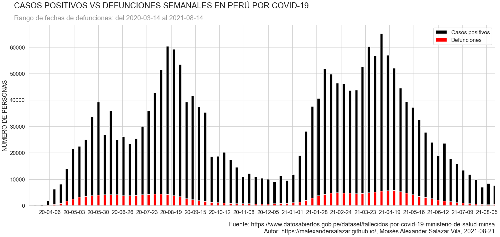
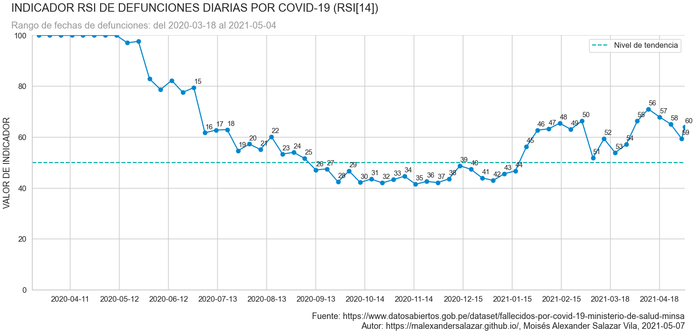

# Análisis de oleadas de defunciones por COVID-19 en Perú

## Antecedentes

La enfermedad por coronavirus (COVID 19) es una ‎enfermedad infecciosa causada por un ‎coronavirus recientemente descubierto. ‎

La mayoría de las personas que enferman de ‎COVID 19 experimentan síntomas de leves a ‎moderados y se recuperan sin tratamiento ‎especial. 

El virus que causa la COVID‑19 se transmite principalmente a través de las gotículas generadas cuando una persona infectada tose, estornuda o espira. Estas gotículas son demasiado pesadas para permanecer suspendidas en el aire y caen rápidamente sobre el suelo o las superficies.

Usted puede infectarse al inhalar el virus si está cerca de una persona con COVID‑19 o si, tras tocar una superficie contaminada, se toca los ojos, la nariz o la boca. [[1]]

## Proceso

Este proyecto se desarrolló en Python 3.8.5 usando los paquetes **pandas**, **matplotlib**, **seaborn** y **datetime**.

### Adquisición de Datos

Obtuve las cifras de defunciones [[2]] y casos positivos [[3]] por COVID-19 actualizadas a la fecha **2021-08-08** de la Plataforma Nacional de Datos Abiertos del Gobierno de Perú. Los conjuntos de datos utilizados están disponibles en el repositorio "Fallecidos por COVID-19" del Ministerio de Salud.

## Resultados

## Bitácora

**2020-10-01** La diagonal (15,22,27) del RSI detecta una tendencia de bajada que sugiere que probablamente entre los meses de Octubre y Noviembre lleguemos a un mínimo de defunciones diarias ocasionadas por la primera ola de COVID-19 en Perú.

**2020-12-24** La diagonal (17, 24, 34) y la horizontal (27, 29, 34) del RSI se rompen con la observación 39. Esto podría significar el inicio de una segunda ola de COVID-19 en Perú que se estaría gestando entre la semana que queda de Diciembre y Enero.

**2021-03-01** La diagonal (42, 44, 49) del RSI confirma una segunda ola de COVID-19 en Perú con una fuerte tendencia de subida. Sin embargo, el indicador SO señala un posible retroceso en el número de defunciones diarias.

**2021-04-01** La diagonal (44,51,53) del RSI confirma el fin del retroceso en el número de defunciones diarias y consolida una tendencia al alza crítica. Según el SO, es muy probable que entre Mayo y Junio obtengamos más máximos historicos de defunciones diarias por COVID-19, así como el pico de la segunda ola de COVID-19 en Perú.

**2021-05-07** A pesar de que el número de defunciones diarias ha retrocedido en la última semana, la diagonal (44,51,53,59) del RSI aún se mantiene. Dada esta situación, aún debemos considerar que es probable que las defunciones aumenten durante los siguientes días. Se recomienda no bajar la guardía hasta tener un claro indicio de que la propagación del virus esta retrocediendo.

**2021-06-27** La última fuente de datos actualizada por el MINSA alteró las observaciones anteriores. Parece que los registros pendientes de defunciones en los meses anteriores e incluso los del año pasado recién fueron introducidos durante el último mes. El pico de la segunda ola de COVID-19 en Perú se alcanzó a finales de Mayo. Sobre esto se puede decir que el periodo en meses promedio de cada ola es de entre 8 y 9 meses.

**2021-08-08** Las observaciones (71,72,73) del RSI y la comparativa de casos/defunciones con la anterior ola nos sugieren que ya llegamos o estamos llegando al final de la segunda ola en Perú. Y dados los resultados, la tercera ola aún no comienza, sin embargo debemos estar muy atentos a los acontecimientos de las siguientes dos semanas.

## Referencias

1. Organización Mundial de la Salud. (07 de octubre de 2021). _Orientaciones para el público_. Organización de las Naciones Unidas. Recuperado el 24 de abril de 2021 de https://www.who.int/emergencies/diseases/novel-coronavirus-2019/advice-for-public

[1]: https://www.who.int/emergencies/diseases/novel-coronavirus-2019/advice-for-public

2. Ministerio de Salud - MINSA. (s.f.). _Fallecidos por COVID-19 -  [Ministerio de Salud - MINSA] | Plataforma Nacional de Datos Abiertos_. Gobierno del Perú. Recuperado el 8 de agosto de 2021 de https://www.datosabiertos.gob.pe/dataset/fallecidos-por-covid-19-ministerio-de-salud-minsa

[2]: https://www.datosabiertos.gob.pe/dataset/fallecidos-por-covid-19-ministerio-de-salud-minsa

3. Ministerio de Salud - MINSA. (s.f.). _Casos positivos por COVID-19 -  [Ministerio de Salud - MINSA] | Plataforma Nacional de Datos Abiertos_. Gobierno del Perú. Recuperado el 8 de agosto de 2021 de https://www.datosabiertos.gob.pe/dataset/casos-positivos-por-covid-19-ministerio-de-salud-minsa

[3]: https://www.datosabiertos.gob.pe/dataset/casos-positivos-por-covid-19-ministerio-de-salud-minsa